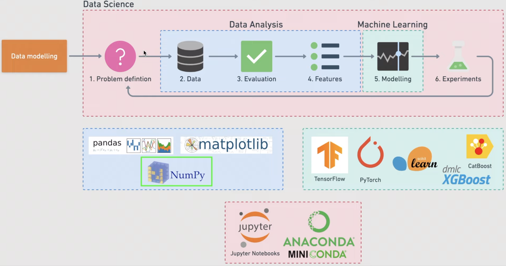

## Data Science Cheat Sheets (Career-Building)

### `I. Roadmap Overview`

1. [Python 3](https://mode.com/python-tutorial/python-basics/) (Lists, Dictionaries, Lambda, Methods, Functions...)
2. [OOP in Python 3](https://www.tutorialspoint.com/python3/python_classes_objects.htm) (Object-Oriented Programming)
3. [SQL](https://mode.com/sql-tutorial/introduction-to-sql/) (Structured Query Language)
4. [Redis](https://redis.io/) (in-memory data store)
5. [PostgreSQL](https://www.postgresql.org/) (Relational Database)
6. [MongoDB](https://www.mongodb.com/) (A document database - NoSQL)
7. [Apache Cassandra](https://cassandra.apache.org/_/index.html) (An open source NoSQL distributed database)
8. 

### `II. Libraries & Frameworks`
1. [Pandas](https://pandas.pydata.org/) with *DataFrame*
2. [Numpy](https://numpy.org/) with *ndarray* object
3. [Matplotlib](https://matplotlib.org/) (Data Visualization)
4. [Seaborn](https://seaborn.pydata.org/) (Data Visualization)
5. [Scikit-Learn](https://scikit-learn.org/stable/) (Machine Learning)
6. [OpenCV](https://opencv.org/) (Computer Vision)
7. [TensorFlow](https://www.tensorflow.org/) (An end-to-end Machine learning & Deep learning platform)
8. [Tkinter](https://wiki.python.org/moin/TkInter) (GUI -Graphical User Interface)
9. [FastAPI](https://fastapi.tiangolo.com/) (Web framework for building APIs with Python 3.7+)
10. [Django](https://www.djangoproject.com/) (Python full-stack web framework )
11. [Airflow](https://airflow.apache.org/) (Author, schedule and monitor workflows)
12. [Selenium](https://selenium-python.readthedocs.io/index.html) (Auto testing with Python)
13. 

### `III. The Fields`
1. Computer Vision
2. Data Engineer
3. Data Analysis
4. Machine Learning
5. Deep Learning
6. 
