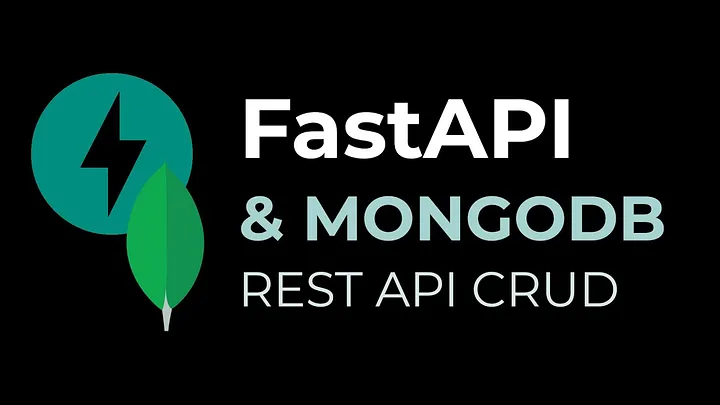

## Extensive FastAPI with MongoDB


### 1. FastAPI
Since FastAPI uses [Starlette](https://www.starlette.io/) framework for the web requests, we have to install an [ASGI](https://asgi.readthedocs.io/en/latest/)(Asynchronous Server Gateway Interface) server as well

```
pip install uvicorn
```

[FastAPI](https://fastapi.tiangolo.com/) is a very cool open-source framework to construct API using Python. Its syntax is similar to [Flask](https://flask.palletsprojects.com/en/1.1.x/), so if you use it, you should not have any trouble learning it.

It has some advantages over Flask, such as:
- It is fast (as compared with Flask);
- It has automatic docs (OpenAPI);
- It can use async functions;
- It has support for websocket;
- And many more [FastAPI](https://medium.com/@tiangolo/introducing-fastapi-fdc1206d453f);

### 2. MongoDB
[MongoDB](https://www.mongodb.com/) is a document database where you can store data directly in JSON format. It is very simple to start and create an application using MongoDB.
Yet it is a powerful tool.
